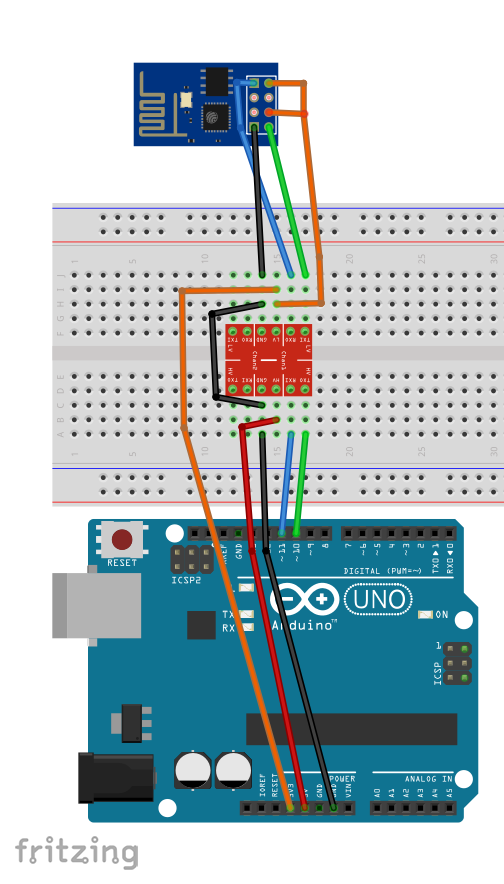

# ESP8266_SoftwareSerial

Based on [ITEAD's library](https://github.com/itead/ITEADLIB_Arduino_WeeESP8266) this library improves communication when using SoftwareSerial to comminucate between the Arduino and the ESP8266.

# Intro
We have modified the original library due to Software serial baudrate problems.
Now, the init function, when using software serial only, will set the ESP8266 baudrate to 9600.

# Wiring
## You'll need:
1. [Arduino Uno](https://www.sparkfun.com/products/11021)
2. ESP8266
3. [Logic Level Converter](https://www.sparkfun.com/products/12009)

# Usage
See example usage in [Firmware.ino](Firmware/Firmware.ino)

# Troubleshooting
   -  If you receive partial response from the esp8266 when using software serial - 
      go to `C:\Program Files (x86)\Arduino\hardware\arduino\avr\libraries\SoftwareSerial\src\SoftwareSerial.h`
      Change line 42: `#define _SS_MAX_RX_BUFF 64 // RX buffer size`
      To: `#define _SS_MAX_RX_BUFF 256 // RX buffer size`
      this will enlarge the software serial buffer.
   -  Sometimes setting the baudrate on initialization fails, try resetting the Arduino, it should work fine.
   -  On some cases it might be necessary to flash the ESP's firmware. See [Flashing the ESP](#Flashing-the-ESP)

# Flashing the ESP
1. Use a 3.3v FTDI board like [this one](https://www.sparkfun.com/products/9873)
2. Hookup the ESP to the FTDI

3. Get the [ESP8266Flasher](https://github.com/nodemcu/nodemcu-flasher/tree/master/Win32/Release)
4. Get the [1.1.1.1 Firmware](https://github.com/mlwmlw/esp8266-workshop/raw/master/firmware/v1.1.1.1%20AT%20Firmware.bin)
5. Flash the ESP!

# Reference
* [ESP's AT Commands guide](https://cdn.sparkfun.com/assets/learn_tutorials/4/0/3/4A-ESP8266__AT_Instruction_Set__EN_v0.30.pdf)

# License
Released under GPLv3. View the [license](LICENSE)
